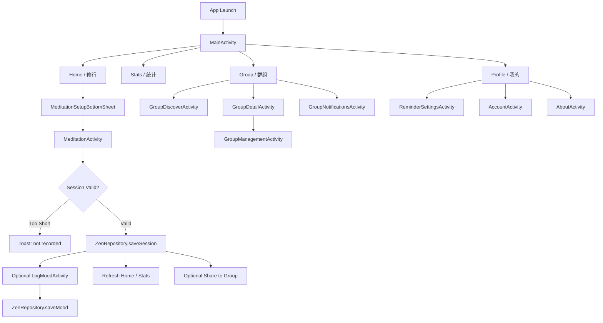
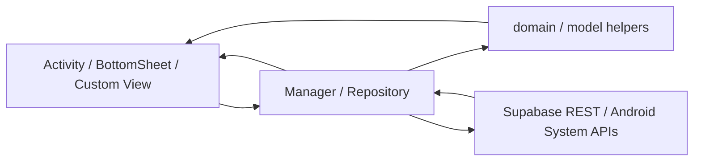
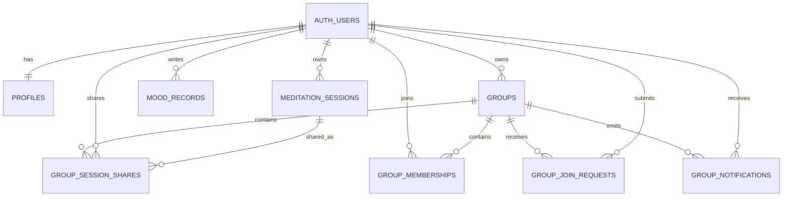

# ZenSee Android 项目开发与维护全景文档 (Single Source of Truth)

> 用途：这是提供给 Codex、Cursor 或其他 AI 助手的项目说明书。默认以本文件为 Android 端项目背景真源，接手开发时不应反复询问基础上下文。

## 1. Project Vision (Why)

`ZenSee` 是一款原生 Android 禅修应用，目标是把用户的禅修从“偶发行为”沉淀为“可开始、可记录、可复盘、可共修”的日常习惯。

### 1.1 产品核心价值

- 降低开始一场禅修的门槛
- 帮助用户持续记录修行与心境变化
- 让用户通过统计与复盘看见长期积累
- 通过群组共修提供陪伴感、约束感和分享感

### 1.2 目标用户

- 有静坐、冥想、正念、情绪调节需求的 C 端用户
- 典型人群包括上班族、学生、自我成长用户、轻度 spiritual/wellness 用户
- 用户希望获得：
  - 快速开始
  - 安静沉浸的练习体验
  - 坚持反馈
  - 心境沉淀
  - 同修陪伴

## 2. Design Keywords

> 这是高优先级约束。做任何 UI 变更时，优先守住这些关键词。

### 2.1 风格关键词

- Warm Stone Interface
- Structured Cards
- Centered Focus
- Calm Utility
- Soft Material Depth
- Serif Metrics
- Rounded Panels
- Gold Accents
- Gentle Glow
- Quiet Motion

### 2.2 反向约束

- 不要高饱和蓝紫科技风
- 不要激进拟物
- 不要廉价玻璃拟态
- 不要把 iOS 视觉直接搬到 Android
- 不要密集信息墙，但也不要为了“禅意”牺牲 Android 端触达效率
- 不要硬边框和强对比荧光色
- 不要与现有暖石色系冲突的新视觉系统

### 2.3 视觉执行原则

- 主视觉基于 `zs_background / zs_surface / zs_primary / zs_gold / zs_seal`
- 首页主锚点是居中的圆形冥想按钮，而不是 iOS 式的大面积自由留白排版
- 统计、历史、个人中心更多采用结构化卡片和分组行
- 数字和统计信息允许更强的层级对比，强调“可读、可扫、可点”
- 禅意主要体现在配色、圆角、节奏、局部字体和动效，而不是大段装饰化视觉
- 动效应克制，只服务于点击反馈、按钮呼吸感和冥想沉浸感

## 3. Feature Map (What)

### 3.1 应用入口与全局导航

- 应用入口为 `MainActivity`
- 四大主 Tab：修行 / 统计 / 群组 / 我的
- `MainActivity` 负责底部导航、四个主分栏和大部分首页聚合渲染
- `Stats` 和 `Profile` 不是独立 Activity 首页，而是 `MainActivity` 内部的 tab content
- 群组首页也是 tab 内嵌内容，只有搜索、详情、通知、管理等流转到独立 Activity
- 当前 Android 端没有单独的首次隐私同意页，也没有独立 Splash ViewModel 结构
- 核心文件：
  - `app/src/main/java/com/zensee/android/MainActivity.kt`
  - `app/src/main/res/layout/activity_main.xml`
  - `app/src/main/AndroidManifest.xml`

### 3.2 认证与账号体系

- 邮箱注册
- 邮箱登录
- 会话恢复
- 忘记密码
- 邮件深链重置密码
- 昵称同步与更新
- 更新密码
- 退出登录
- 注销账号及数据清理
- 核心文件：
  - `app/src/main/java/com/zensee/android/AuthManager.kt`
  - `app/src/main/java/com/zensee/android/LoginActivity.kt`
  - `app/src/main/java/com/zensee/android/SignUpActivity.kt`
  - `app/src/main/java/com/zensee/android/ForgotPasswordActivity.kt`
  - `app/src/main/java/com/zensee/android/PasswordRecoveryUpdateActivity.kt`
  - `app/src/main/java/com/zensee/android/AccountActivity.kt`
  - `app/src/main/java/com/zensee/android/AuthRequestRetrier.kt`
  - `app/src/main/java/com/zensee/android/SessionAwareRequestExecutor.kt`

### 3.3 冥想主流程

- 首页展示今日禅修时间
- 快速开始一场禅修
- 时长选择 `5...120` 分钟
- 收功时间选择 `0 / 5 / 10 / 15`
- BottomSheet 方式配置禅修参数
- 沉浸式计时
- 点击暂停 / 恢复
- 提前结束
- 开始、收功、结束音效
- 过短会话不写入正式记录
- 保存禅修记录并刷新首页与统计
- 核心文件：
  - `app/src/main/java/com/zensee/android/MeditationSetupBottomSheet.kt`
  - `app/src/main/java/com/zensee/android/MeditationActivity.kt`
  - `app/src/main/java/com/zensee/android/domain/MeditationCountdownEngine.kt`
  - `app/src/main/java/com/zensee/android/ZenAudioManager.kt`
  - `app/src/main/java/com/zensee/android/widget/DialRulerView.kt`
  - `app/src/main/java/com/zensee/android/data/ZenRepository.kt`

### 3.4 心境记录与觉察

- 冥想结束后记录心情
- 支持备注文本
- 首页展示当前心境
- 首页展示最近心境分组
- 心境历史页
- 单条心境详情弹窗
- 核心文件：
  - `app/src/main/java/com/zensee/android/LogMoodActivity.kt`
  - `app/src/main/java/com/zensee/android/MoodHistoryActivity.kt`
  - `app/src/main/java/com/zensee/android/data/ZenRepository.kt`
  - `app/src/main/java/com/zensee/android/domain/MoodLoggingRules.kt`
  - `app/src/main/java/com/zensee/android/model/ZenModels.kt`

### 3.5 统计与复盘

- 总分钟数
- 累计禅修天数
- 连续坚持天数
- 周 / 月 / 近 30 天趋势
- 柱状图 / 折线图切换
- 年度热力图
- 冥想历史记录
- 当日记录分享入口
- 未登录状态有独立占位页和登录引导
- 统计主视图以内嵌滚动页形式呈现在主 Tab，而不是单独的 Stats Activity
- 核心文件：
  - `app/src/main/java/com/zensee/android/MainActivity.kt`
  - `app/src/main/java/com/zensee/android/MeditationHistoryActivity.kt`
  - `app/src/main/java/com/zensee/android/domain/ZenStatsCalculator.kt`
  - `app/src/main/java/com/zensee/android/domain/StatsTrendBuilder.kt`
  - `app/src/main/java/com/zensee/android/widget/StatsTrendChartView.kt`
  - `app/src/main/java/com/zensee/android/widget/StatsYearHeatmapView.kt`

### 3.6 群组与共修

- 创建群组
- 搜索群组
- 申请加入群组
- 显示待审核状态
- 群主审批 / 拒绝申请
- 群通知中心
- 未读角标
- 群详情
- 今日打卡成员列表
- 群主管理成员
- 成员退群
- 群主解散群组
- 分享单次禅修到群
- 首页聚合群数据
- 搜索与发现页采用顶部 Toolbar + 搜索输入 + 结果列表的标准 Android 结构
- 群首页区分 owned/joined 两段内容，并带空态与错误态
- 核心文件：
  - `app/src/main/java/com/zensee/android/data/GroupRepository.kt`
  - `app/src/main/java/com/zensee/android/GroupDiscoverActivity.kt`
  - `app/src/main/java/com/zensee/android/GroupCreateActivity.kt`
  - `app/src/main/java/com/zensee/android/GroupDetailActivity.kt`
  - `app/src/main/java/com/zensee/android/GroupManagementActivity.kt`
  - `app/src/main/java/com/zensee/android/GroupNotificationsActivity.kt`
  - `app/src/main/java/com/zensee/android/GroupUi.kt`
  - `app/src/main/java/com/zensee/android/GroupPresentationRules.kt`
  - `app/src/main/java/com/zensee/android/model/GroupModels.kt`

### 3.7 个人中心与本地能力

- 声音开关
- 每日提醒
- 分享 APP
- 帮助与反馈
- 关于页
- 在线查看法律文档
- 账号页
- 整体呈现更接近 Android 设置页结构，而不是卡片流信息页
- 法律文档通过系统浏览器打开 GitHub Pages，不是内嵌浏览器
- 核心文件：
  - `app/src/main/java/com/zensee/android/MainActivity.kt`
  - `app/src/main/java/com/zensee/android/ReminderManager.kt`
  - `app/src/main/java/com/zensee/android/ReminderSettingsActivity.kt`
  - `app/src/main/java/com/zensee/android/ReminderReceiver.kt`
  - `app/src/main/java/com/zensee/android/ReminderBootReceiver.kt`
  - `app/src/main/java/com/zensee/android/FeedbackActivity.kt`
  - `app/src/main/java/com/zensee/android/AboutActivity.kt`
  - `app/src/main/java/com/zensee/android/AccountActivity.kt`
  - `app/src/main/java/com/zensee/android/SettingsManager.kt`

### 3.8 通用组件与 UI 基础设施

- 主按钮样式
- 次按钮样式
- BottomSheet 主题定制
- PopupMenu 皮肤
- 系统栏样式控制
- Loading Button 控制器
- 小型文字排版 Span
- 核心文件：
  - `app/src/main/java/com/zensee/android/SystemBarStyler.kt`
  - `app/src/main/java/com/zensee/android/LoadingButtonController.kt`
  - `app/src/main/java/com/zensee/android/RaisedBaselineSpan.kt`
  - `app/src/main/res/values/styles.xml`
  - `app/src/main/res/values/themes.xml`
  - `app/src/main/res/values/colors.xml`

## 4. Mermaid Overview

### 4.1 业务主链路

### 4.2 代码数据流

### 4.3 数据库关系图

## 5. Design Blueprint (How)

### 5.1 技术栈

- UI：Android View System + XML Layout
- 绑定方式：ViewBinding
- 异步：`thread {}` + `runOnUiThread {}` + 少量 Activity Result API
- 后端：Supabase REST/Auth，自行封装 HTTP 调用
- 音频：Android Media / Raw Resource
- 本地通知与闹钟：`AlarmManager`, `NotificationManager`, `BroadcastReceiver`
- 分享：`Intent.ACTION_SEND`
- 法务文档：`Intent.ACTION_VIEW` 打开外部浏览器中的 GitHub Pages

### 5.2 架构模式

- 主体模式：`Activity-centric UI + Manager / Repository + domain helpers`
- 附加机制：
  - `object` 单例承担全局状态和系统能力
  - `Repository` 直接负责 REST 请求与本地快照
  - `custom View / widget` 负责复杂图表与交互
- 当前不是 Compose，不是标准 MVVM，也不是严格 Clean Architecture

### 5.3 分层职责

- `Activity / BottomSheet`
  - 负责页面渲染
  - 负责交互分发
  - 负责调用 Manager / Repository
  - 当前很多页面直接在 Activity 内完成状态拼装，而不是抽独立 ViewModel
- `Repository`
  - 负责 Supabase 表读写
  - 负责数据快照与聚合读取
  - 不承担复杂视觉逻辑
- `Manager`
  - 负责认证、提醒、音频、设置等全局能力
- `domain`
  - 负责纯业务算法
  - 例如倒计时、趋势构造、统计计算、心境规则
- `model`
  - 负责数据实体
- `widget`
  - 负责图表与定制控件

### 5.4 全局状态中心

- `AuthManager`
  - 认证态
  - 当前用户信息
  - 会话恢复与刷新
  - 密码恢复链路
- `ReminderManager`
  - 提醒开关
  - 时间
  - 通知 / 闹钟调度
- `ZenAudioManager`
  - 声音开关
  - 音频播放
- `SettingsManager`
  - 偏好存取
- `ZenRepository`
  - 禅修 / 心境 / 统计本地快照
- `GroupRepository`
  - 群组相关远端读写

### 5.5 刷新机制

- 当前 Android 端没有统一事件总线文件
- 主要刷新方式是：
  - `ActivityResultLauncher`
  - `AuthManager` 认证态回调
  - `renderAll()` / `renderGroups()` / `renderStats()`
  - 禅修完成后主动刷新本地与远端数据
- 做跨页面数据修改时，优先沿用已有回调和显式刷新，不要凭空引入新的全局事件框架

### 5.6 数据库字典

#### 5.6.1 明确存在的 Supabase 表

- `public.groups`
  - `id uuid`
  - `owner_id uuid`
  - `name text`
  - `description text`
  - `member_count integer`
  - `created_at timestamptz`
  - `updated_at timestamptz`

- `public.group_memberships`
  - `id uuid`
  - `group_id uuid`
  - `user_id uuid`
  - `role text`
  - `created_at timestamptz`

- `public.group_join_requests`
  - `id uuid`
  - `group_id uuid`
  - `applicant_id uuid`
  - `status text`
  - `created_at timestamptz`
  - `updated_at timestamptz`
  - `handled_at timestamptz`

- `public.group_notifications`
  - `id uuid`
  - `recipient_user_id uuid`
  - `actor_user_id uuid`
  - `group_id uuid`
  - `join_request_id uuid`
  - `type text`
  - `title text`
  - `body text`
  - `is_read boolean`
  - `created_at timestamptz`

- `public.group_session_shares`
  - `id uuid`
  - `group_id uuid`
  - `user_id uuid`
  - `meditation_session_id uuid`
  - `created_at timestamptz`

#### 5.6.2 高置信逆推表

- `public.profiles`
  - `id uuid`
  - `nickname text`
  - `updated_at timestamptz`

- `public.meditation_sessions`
  - `id uuid`
  - `user_id uuid`
  - `session_date text`
  - `duration_minutes integer`
  - `created_at timestamptz`
  - `started_at text or timestamptz`
  - `ended_at text or timestamptz`

- `public.mood_records`
  - `id uuid`
  - `user_id uuid`
  - `mood text`
  - `note text`
  - `meditation_duration integer`
  - `created_at timestamptz`

#### 5.6.3 数据库视图

- `public.group_member_daily_rollups`
- `public.group_join_request_overviews`
- `public.group_notification_feed`

#### 5.6.4 函数与触发器

- `set_timestamp`
- `is_group_member`
- `is_group_owner`
- `enforce_group_owner_limit`
- `create_group_owner_membership`
- `sync_group_member_count`
- `prevent_owner_membership_delete`
- `validate_group_join_request`
- `notify_group_join_request`
- `process_group_join_request`
- `notify_group_member_left`
- `delete_user` RPC

#### 5.6.5 数据库事实来源

- Android 仓库当前没有单独保存 SQL 文档
- 后端结构与 iOS 端使用的 Supabase schema 保持一致
- 需要查 SQL / RLS 细节时，优先对照 iOS 仓库的：
  - `docs/supabase/group_feature_schema.sql`
  - `docs/supabase/group_sql_runbook.md`

### 5.7 RLS 设计原则

- 客户端使用 anon key，权限控制依赖 RLS
- 原则如下：
  - 所有认证用户可读群组列表
  - 只有群主可修改 / 删除自己的群
  - 只有申请人可提交入群申请
  - 只有群主可审批入群申请
  - 只有通知接收者可读通知和改已读
  - 只有群成员可读群分享数据
  - 只有 session 所有者可分享自己的禅修会话

### 5.8 UI 风格指南

#### 色彩

- 主强调色：`zs_primary = #8E8071`
- 金色高亮：`zs_gold / zs_stats_gold`
- 浅色背景：`zs_background = #F5F2ED`
- 表面色：`zs_surface = #FFFCF8`
- 辅助表面与描边：`zs_surface_alt / zs_border / zs_ring / zs_card_stroke`
- 印章红：`zs_seal = #B93E34`

#### 字体

- 常规 UI 使用系统 sans-serif
- 统计数字、分钟数、累计值会混入 `serif`
- 禅语与首页引文使用 `Ma Shan Zheng`
- Android 端不是大面积装饰字体系统，书法字体只用于局部情绪化表达

#### 布局与组件

- 主题：`Theme.ZenSee`
- Primary Button：`Widget.ZenSee.PrimaryButton`
- Secondary Button：`Widget.ZenSee.SecondaryButton`
- BottomSheet：`ThemeOverlay.ZenSee.BottomSheetDialog`
- 首页以大圆形冥想按钮作为主 CTA，外层带柔和 ripple ring
- 首页卡片、统计区块、个人中心分组都采用圆角卡片容器
- 个人中心偏标准 Android 设置页范式：图标容器 + 标题 + 开关/箭头
- 统计页偏“单页滚动仪表盘”，而不是拆散的多个层级页面
- 群组发现页偏标准工具型页面，不追求 iOS 式首页化包装
- 冥想页以大号居中计时文本和底部 capsule 控件为核心，不追求复杂层叠装饰

#### 动效

- 当前动效以 `View.animate()`、缩放反馈、透明度反馈为主
- 禅修启动按钮有脉冲与按压反馈
- 动效应服务于点击反馈和沉浸，不做花哨转场
- Android 端视觉反馈允许更直接，不需要刻意模仿 iOS 的轻柔过渡

## 6. Tech Standards

### 6.1 命名规范

- 类型：`PascalCase`
- 属性 / 方法：`camelCase`
- 数据库字段：`snake_case`
- Activity：`XxxActivity`
- Repository：`XxxRepository`
- Manager：`XxxManager`
- 纯算法：放在 `domain/`
- 自定义控件：放在 `widget/`

### 6.2 代码组织规范

- 新功能默认放入既有目录：
  - `app/src/main/java/com/zensee/android`
  - `app/src/main/java/com/zensee/android/data`
  - `app/src/main/java/com/zensee/android/domain`
  - `app/src/main/java/com/zensee/android/model`
  - `app/src/main/java/com/zensee/android/widget`
  - `app/src/main/res/layout`
  - `app/src/main/res/drawable`
- 不要把复杂网络逻辑写进 Activity
- Repository 负责表读写，Activity 负责状态拼装与页面交互
- 不默认引入新的模块化拆分、依赖注入框架或状态管理框架

### 6.3 并发与状态规范

- 当前项目默认使用：
  - `thread {}`
  - `runOnUiThread {}`
  - Activity Result API
- 涉及 UI 更新必须回到主线程
- 不要在没有必要的情况下引入协程、Flow、Rx 或其他新的响应式层

### 6.4 错误处理规范

- 本地校验优先在 Activity 或 domain 规则中完成
- 表现层使用：
  - `Toast`
  - 内联错误文案
  - `AlertDialog` / 双确认弹窗
- 危险操作必须双确认：
  - 退群
  - 解散群组
  - 注销账号

### 6.5 刷新一致性规范

- 禅修记录写入后必须刷新首页与统计
- 心境记录写入后必须刷新首页与历史
- 群数据变化后必须刷新群组列表、详情和未读数
- 认证态切换后必须重绘主界面状态

### 6.6 本地化规范

- 用户可见字符串优先写入 `strings.xml`
- 当前资源目录包括：
  - `values`（默认简中基线）
  - `values-ja`
  - `values-zh-rTW`
- 英文目前主要用于 Web 下载页，不是完整 Android UI 语言包
- Android 端当前不是完整多语言对等实现，新增文案时要判断是否需要同步补齐 `ja / zh-rTW`
- 不要新增大量硬编码不可翻译字符串

### 6.7 UI 兼容规范

- 新 UI 必须延续 Android 端现有暖石禅意风格，而不是追求与 iOS 完全一致
- 优先复用现有 color token、button style、shape 和 drawable
- 新卡片、弹层、按钮优先沿用现有圆角、分组卡片和胶囊控件体系
- 主题基础是 `Theme.MaterialComponents.DayNight.NoActionBar`
- 优先保留 Android 交互习惯：
  - 底部导航
  - 设置行
  - Switch
  - BottomSheet
  - 返回栈与独立 Activity 页面
- 改 UI 时要同时注意浅色/夜间资源兼容，但不要借机重做成另一套新视觉

### 6.8 后端兼容规范

- 默认保持与现有 Supabase schema 对齐
- 不随意修改表名、字段名、视图名
- 扩展数据库时优先同时提供：
  - SQL migration
  - RLS policy
  - 对应 Kotlin model
  - 对应 Repository 方法
- 当前 REST 请求很多是手写拼接，改接口时优先保持现有风格一致

### 6.9 发布规范

- 稳定 APK 链接固定为：
  - `downloads/latest/ZenSee-android-latest.apk`
- Web 下载页与 App 内分享逻辑依赖稳定链接，不应频繁改动
- 发布新包时优先使用：
  - `./scripts/publish-release.sh`

## 7. Future Roadmap

### 7.1 已有清晰扩展点

- 认证扩展
  - Apple 登录
  - Google 登录
  - 用户头像
  - 个人签名

- 冥想扩展
  - 更多引导音
  - 阶段化冥想模式
  - 背景声
  - 主题化计时场景

- 统计扩展
  - 月报 / 周报
  - 成就系统
  - 目标系统
  - 连续打卡挑战

- 群组扩展
  - 群公告
  - 打卡排行榜
  - 邀请链接
  - 举报 / 管理规则
  - 群目标挑战

- 提醒扩展
  - 多时段提醒
  - 工作日提醒
  - 更丰富通知策略

- 运营扩展
  - 埋点
  - 崩溃监控
  - 远程配置
  - 版本公告

### 7.2 推荐扩展落点

- 新业务数据结构：
  - `app/src/main/java/com/zensee/android/model`
- 新后端交互：
  - `app/src/main/java/com/zensee/android/data`
- 新页面：
  - `app/src/main/java/com/zensee/android`
  - `app/src/main/res/layout`
- 新纯算法：
  - `app/src/main/java/com/zensee/android/domain`
- 新图表或复杂控件：
  - `app/src/main/java/com/zensee/android/widget`
- 新设计 token：
  - `app/src/main/res/values/colors.xml`
  - `app/src/main/res/values/styles.xml`
  - `app/src/main/res/values/themes.xml`

### 7.3 AI 接手默认前提

- 默认沿用 `Activity + Repository / Manager + domain / widget`
- 默认沿用 `Supabase + RLS`
- 默认沿用显式刷新，而不是引入新状态框架
- 默认沿用暖石禅意视觉系统
- 默认不引入 Compose / Redux / 大规模重构
- 默认以最小破坏方式扩展已有功能

## 8. Fast Start for AI Agents

### 8.1 先读哪些文件

- `README.md`
- `PROJECT_SSoT.md`
- `app/build.gradle`
- `app/src/main/AndroidManifest.xml`
- `app/src/main/java/com/zensee/android/MainActivity.kt`
- `app/src/main/java/com/zensee/android/AuthManager.kt`
- `app/src/main/java/com/zensee/android/data/ZenRepository.kt`
- `app/src/main/java/com/zensee/android/data/GroupRepository.kt`
- `app/src/main/java/com/zensee/android/ReminderManager.kt`
- `scripts/publish-release.sh`

### 8.2 开发前默认判断

- 如果改页面，先找对应 `Activity + layout`
- 如果改数据，先找对应 `Repository + model`
- 如果改统计，先看 `domain` 和 `widget`
- 如果改群组权限，先核对 Supabase schema 与 RLS
- 如果改视觉，先看颜色 token、drawable 和 button style
- 如果改发布链路，先看 `downloads/latest` 和 `scripts/publish-release.sh`

### 8.3 一句话交接提示

把 `ZenSee Android` 视为一个以 `原生 Activity + 单例 Manager / Repository + Supabase REST` 驱动的禅修习惯应用，现有核心约束是“暖石禅意视觉、轻量可维护结构、RLS 保证后端权限、稳定 latest APK 下载路径”。 
